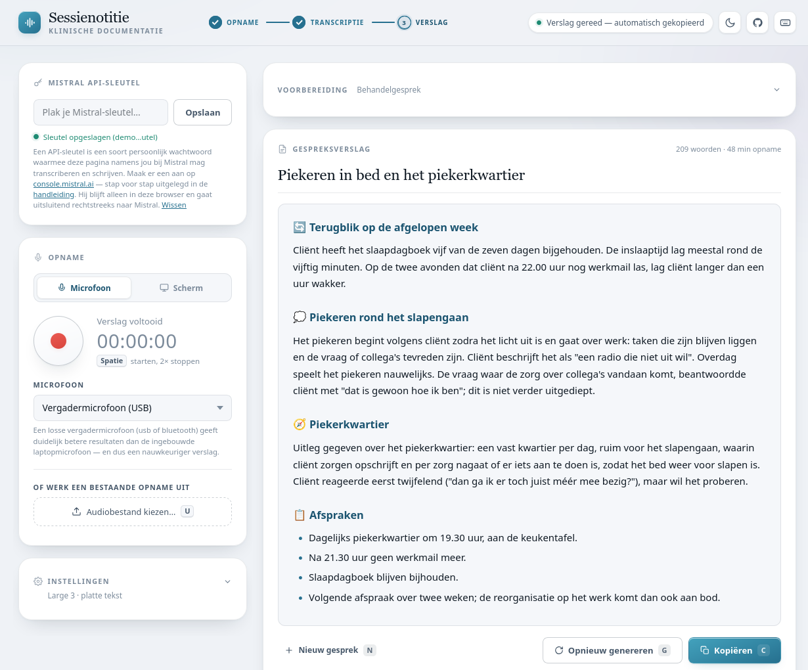
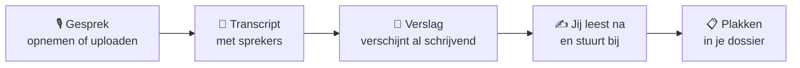
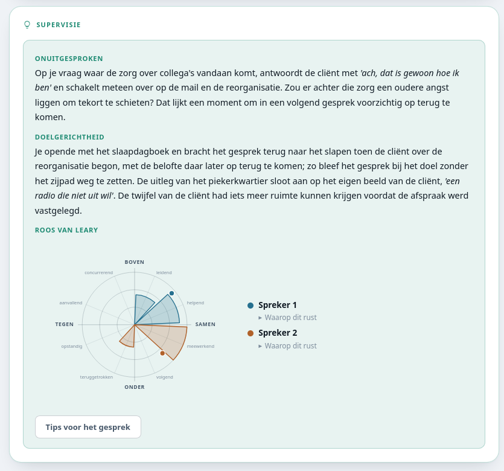
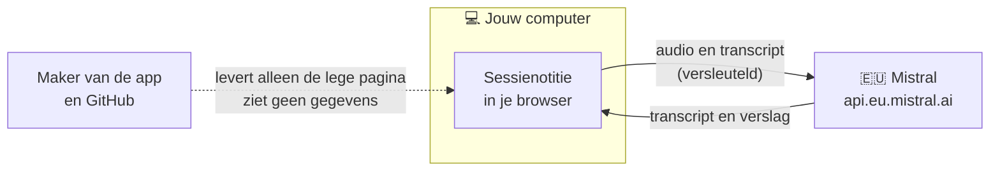

# Sessienotitie

**Van gesprek naar dossierverslag in een paar minuten — in je eigen browser, met je eigen
Mistral-sleutel, zonder tussenpersoon.**

Sessienotitie is een gratis, open-source hulpmiddel voor psychologen en andere behandelaars.
Je neemt het gesprek op, en de app maakt er een transcript en een helder, feitelijk
dossierverslag van. Jij leest het na, stuurt bij waar nodig en plakt het in je dossier.
Zo houd je je aandacht bij je cliënt, en niet bij je aantekeningen.

**[Open de app →](https://klankschrift.github.io/sessienotitie/)** &nbsp;·&nbsp;
[In vier stappen aan de slag](#in-vier-stappen-aan-de-slag) &nbsp;·&nbsp;
[Handleiding](HANDLEIDING.md) &nbsp;·&nbsp;
[Privacy](PRIVACY.md)

<picture>
  <source media="(prefers-color-scheme: dark)" srcset="docs/img/verslag-donker.png">
  
</picture>

Schermafbeelding met een verzonnen oefengesprek.

> 🔒 **Voor échte cliëntgesprekken: eerst Zero Data Retention aan.** Zonder ZDR bewaart
> Mistral je gegevens standaard ongeveer 30 dagen, en dat is voor gezondheidsgegevens niet
> acceptabel. Oefenen met een nagespeeld gesprek kan meteen; hoe je ZDR regelt, staat in
> [stap 4](#stap-4--voor-echte-cliëntgesprekken-zet-zero-data-retention-aan). Ook mét ZDR
> ben je niet automatisch klaar voor NEN 7510 — lees [Privacy](#privacy-eerlijk-over-wat-er-gebeurt).

---

## Hoe het werkt

Je hoeft niets te installeren: de hele app is één webpagina. Het luisterwerk en het
schrijfwerk doen de taalmodellen van **Mistral**, een Europees AI-bedrijf. Daar betaal je
per gesprek een paar cent voor, rechtstreeks aan Mistral. De app zelf is gratis, en de
maker ziet je gegevens niet.

---

## Wat je eraan hebt

**Een verslag dat leest als een dossierverslag.** Thematisch, feitelijk en zonder
opsmuk. Een **intake** krijgt de vaste kopjes die je wilt afvinken; een
**behandelgesprek** krijgt de indeling die bij dít gesprek past. Wil je een titel of
emoji bij de kopjes, dan zet je dat aan.

**Jij houdt de regie.** Het verslag is gewoon bewerkbaar. Moet er meer anders, typ dan in
gewone taal wat je wilt (*"werk de afspraken uit, elk met een eigen kopje"*) en het wordt
opnieuw geschreven. Alle versies blijven bewaard om tussen te bladeren. En twijfel je
waar een zin vandaan komt? Selecteer hem en klik op **Waar staat dit?**: de app wijst de
plek in het transcript aan, en zegt het als het transcript de zin niet helemaal draagt.

**Een extra paar ogen voor veiligheid.** Naast het verslag zoekt een aparte controle naar
signalen als doodsgedachten, zelfbeschadiging, geweld of zorgen om kinderen — ook als
ze werden uitgevraagd en ontkend. Is er iets, dan staat het boven het verslag, met de
plek in het transcript.

**Een supervisor die meekijkt.** Wil je dat, dan krijg je in een apart venster een
reflectie op het gesprek: wat er onuitgesproken bleef, hoe doelgericht het was, en hoe
jij en je cliënt zich tegenover elkaar opstelden op de **roos van Leary**. Op verzoek
volgen tips voor het volgende gesprek. Dit is alleen voor jou en gaat nooit mee als je
kopieert.

<picture>
  <source media="(prefers-color-scheme: dark)" srcset="docs/img/supervisie-donker.png">
  
</picture>

**Meer dan een verslag.** Met één klik maak je uit het verslag een **brief aan de huisarts
of verwijzer**, een **samenvatting voor de cliënt** in eenvoudige taal (B1), of **alleen
het huiswerk**. Bij een intake heeft elke sectie een eigen kopieerknop, voor dossiers met
een apart veld per onderwerp.

**Werkt zoals jij werkt.** In de spreekkamer met een microfoon, bij een online gesprek
via **scherm + audio** (beide kanten worden opgenomen), met een audiobestand dat je al
had, of met een transcript uit een ander programma. Het verslag staat zodra het klaar is
al op je klembord, als platte tekst, Markdown of opgemaakte tekst.

**Bestand tegen pech.** Valt je bluetooth-microfoon weg, dan hoor je meteen een zacht
signaal, en na het opnieuw verbinden ga je verder in dezelfde opname. Crasht je computer, dan staat de
opname er bij het opnieuw openen nog. En met sneltoetsen, een donkere modus en een
rustige indeling blijft het prettig werken, ook aan het eind van een lange dag.

Alles hierover lees je in de **[handleiding](HANDLEIDING.md)**.

---

## Privacy: eerlijk over wat er gebeurt

Je werkt met de meest gevoelige gegevens die er zijn. Daarom hier zonder omwegen wat
er met een gesprek gebeurt.

**Wat goed geregeld is**

- Audio en transcript gaan **rechtstreeks** van jouw browser naar Mistral. Er zit geen
  server van de maker tussen; de maker en GitHub zien je gegevens niet.
- Mistral verwerkt in de **EU**, via het Europese endpoint, en is **ISO
  27001**-gecertificeerd. API-gegevens worden niet gebruikt om modellen te trainen.
- Op je eigen computer blijft **geen gespreksinhoud** achter. Transcript en verslag
  verdwijnen zodra je het tabblad sluit; alleen je API-sleutel en je instellingen
  onthoudt de browser. (Na een crash blijft de opname bewaard tot je de app weer opent,
  zodat je hem alsnog kunt verwerken.)

**Waar je zelf voor zorgt**

- **Zero Data Retention (ZDR) is de ondergrens.** Zonder ZDR bewaart Mistral API-verkeer
  standaard ongeveer 30 dagen voor misbruikdetectie. Gebruik de app voor herleidbare
  cliëntgegevens dus pas als ZDR aanstaat ([stap 4](#stap-4--voor-echte-cliëntgesprekken-zet-zero-data-retention-aan)).
- **ZDR is noodzakelijk, maar niet voldoende.** Een tool kan niet "NEN 7510-conform"
  zijn; een praktijk is dat (of niet). Je blijft zelf verwerkingsverantwoordelijke: denk
  aan een verwerkersovereenkomst met Mistral en aan het informeren van je cliënten.
- **Controleer elk verslag** voordat het in het dossier gaat. Spraakherkenning en
  taalmodellen maken fouten; de inhoudelijke verantwoordelijkheid blijft bij jou.

De volledige, eerlijke toelichting — dataretentie, ZDR, NEN 7510, de AVG en de supervisie
als apart verwerkingsdoel — staat in **[PRIVACY.md](PRIVACY.md)**. Lees die voordat je
met echte cliënten begint.

---

## Wat kost het?

De app zelf is gratis. Je betaalt alleen Mistral, naar gebruik: geen abonnement, geen
minimum.

| Gesprek | Ongeveer |
|---|---|
| Doorsnee sessie | **10 à 15 cent** |
| Vol uur | **ruim onder de 25 cent** |

Hoe die bedragen zijn opgebouwd

- **Transcriptie (Voxtral):** ongeveer **€0,003 per minuut** audio (Mistral rekent af in
  dollars, $0,003/min; in euro's komt dat vrijwel op hetzelfde neer). Een half uur kost dus
  zo'n **8 cent**, een vol uur ongeveer **16 cent**.
- **Verslag:** ongeveer **3 eurocent** per gesprek.
- **Herzien of opnieuw genereren:** kost telkens ongeveer een nieuw verslag (~3 cent). Het
  transcriberen gebeurt maar één keer, dus dat telt niet opnieuw mee.
- **Veiligheidscontrole:** ongeveer een cent, één keer per transcript. **Tips**, **Waar
  staat dit?** en de **documenten voor de cliënt** kosten alleen iets als je erom vraagt —
  een documentje uit het verslag een fractie van een cent.
- **Large 4 met nadenken** is duurder dan Large 3: het denkwerk telt mee.

Onder de streep blijft een doorsnee sessie meestal rond de **10 à 15 eurocent**; ook een vol
uur blijft ruim onder de 25 cent. Bewust koos deze app voor de **beste** modellen in plaats
van goedkopere: het kwaliteitsverschil is voor klinische verslagen veel meer waard dan de
paar cent die je ermee zou besparen.

Raadpleeg [mistral.ai/pricing](https://mistral.ai/pricing) voor actuele tarieven.

---

## In vier stappen aan de slag

Geen zorgen als je niet technisch bent: je hoeft niets te installeren en geen code te
begrijpen. De eerste drie stappen doe je één keer, in zo'n kwartier; daarna kun je
oefenen. Stap 4 heb je nodig voordat je met echte cliënten werkt.

**Wat je nodig hebt**

- **Een moderne browser.** Opnemen met de microfoon werkt in Chrome, Edge, Firefox en
  Safari, ook op iPhone en iPad. **Scherm + audio** (voor online gesprekken) werkt alleen
  in Chrome, Edge, Brave en Vivaldi. Een bestaande opname uploaden werkt overal.
- **Een goede microfoon.** Hoe beter de opname, hoe beter het verslag. Een losse
  **vergadermicrofoon** (via USB of bluetooth) geeft duidelijk betere resultaten dan de
  ingebouwde laptopmicrofoon, die verder weg staat en meer omgevingsgeluid opvangt. Zorg
  ook voor een rustige ruimte.
- **Een betaalmethode** voor je Mistral-account.

### Stap 1 — Maak een Mistral-account

1. Ga naar **[console.mistral.ai](https://console.mistral.ai)** en maak een account aan.
2. Voeg een **betaalmethode** toe. Je betaalt per seconde audio en per stuk tekst; voor een
   gesprek gaat het om enkele centen (zie [Wat kost het?](#wat-kost-het)).

### Stap 2 — Maak een API-sleutel

Een API-sleutel is een soort persoonlijk wachtwoord waarmee de app namens jou bij Mistral
mag transcriberen en schrijven.

1. Ga naar **[console.mistral.ai/api-keys](https://console.mistral.ai/api-keys)**.
2. Klik op **Create new key**, geef hem eventueel een naam zoals "Sessienotitie" en
   bevestig.
3. **Kopieer de lange tekenreeks die verschijnt meteen** — vaak kun je hem later niet
   meer volledig terugzien. Ben je hem kwijt, maak dan gewoon een nieuwe.

Wat is een API-sleutel precies, en is dat veilig?

Deze app heeft zelf geen "verstand": het werkelijke transcriberen en schrijven gebeurt
bij **Mistral**. Om namens jou met Mistral te mogen praten, heeft de app een soort
persoonlijke toegangscode nodig: de **API-sleutel**.

Vergelijk het met een **bankpas met pincode voor je Mistral-account**: het is een lange,
geheime reeks tekens die bewijst "dit ben ik, en dit gebruik mag op mijn rekening worden
geboekt". Een paar dingen om te weten:

- De sleutel hoort **bij jouw Mistral-account**; het gebruik (en de kosten) gaan via jou.
- Houd hem **geheim**, net als een wachtwoord. Deel hem niet en zet hem niet online.
- Je kunt een sleutel altijd **verwijderen of vervangen** in je Mistral-account. Raakt
  hij zoek of gedeeld, dan maak je gewoon een nieuwe en gooi je de oude weg.
- In deze app blijft de sleutel **alleen in je eigen browser** staan (hij wordt nergens
  anders heen gestuurd dan naar Mistral). Op een gedeelde of openbare computer kun je hem
  beter na gebruik wissen met de knop **Wissen**.

### Stap 3 — Open de app en plak je sleutel

1. Open **[klankschrift.github.io/sessienotitie](https://klankschrift.github.io/sessienotitie/)**
   en maak er meteen een **bladwijzer** van.
2. Plak je sleutel linksboven in het vak **Mistral API-sleutel** en klik op **Opslaan**.
3. Geef toestemming voor de microfoon als de browser daarom vraagt.

Klaar! De browser onthoudt je sleutel en je microfoontoestemming, dus dit doe je maar één
keer (behalve in een privé- of incognitovenster). **Probeer het nu uit met een nagespeeld
gesprek**, bijvoorbeeld met een collega: druk op de rode knop, praat een paar minuten,
druk nog eens, en kijk wat er gebeurt.

Liever een eigen kopie op je computer, zonder website?

Je hebt maar één bestand nodig: **`index.html`**. Bij deze manier gaan audio en
transcript net zo goed **rechtstreeks** van je browser naar Mistral.

1. Open op de projectpagina het bestand **`index.html`** (klik op de bestandsnaam).
2. Klik rechtsboven het bestand op de knop **Download raw file** — het download-icoon
   (een pijltje omlaag). Gebruik niet "kopiëren" of "Raw bekijken".
3. Sla het op een vaste plek op, bijvoorbeeld je **bureaublad** of een map "Sessienotitie".
4. **Let op:** de bestandsnaam moet eindigen op **`.html`** (niet `.htm.txt` of `.txt`).
   Slaat je browser het toch als tekstbestand op, hernoem het dan zodat het op `.html`
   eindigt.

Lukt het downloaden van het losse bestand niet? Klik dan op de groene knop **Code →
Download ZIP**, pak het gedownloade ZIP-bestand uit (rechtsklik → "Alles uitpakken") en
gebruik de `index.html` die erin zit.

**Openen:** dubbelklik op het gedownloade `index.html`. Het opent in je standaardbrowser en
werkt meteen. Je hebt geen internet nodig behalve voor de verbinding met Mistral zelf.

Eén nadeel: omdat je een bestand op je eigen computer opent, onthoudt de browser je
**microfoontoestemming niet** — die geef je bij elke opname opnieuw. (Voor de microfoon
eist de browser een "veilige context": een lokaal bestand of een `https://`-adres. Een
gewone `http://`-host zonder slotje werkt niet voor opnemen.)

### Stap 4 — Voor echte cliëntgesprekken: zet Zero Data Retention aan

Met **Zero Data Retention (ZDR)** bewaart Mistral helemaal niets meer nadat je verzoek
is afgehandeld. Voor cliëntgesprekken is dat geen optie, maar een **minimumvereiste**.
ZDR staat niet standaard aan en moet worden goedgekeurd, dus vraag het op tijd aan.

1. ZDR is beschikbaar op het **Scale-plan**. Vraag het aan via het
   [Mistral Help Center](https://help.mistral.ai/en/articles/347612-can-i-activate-zero-data-retention-zdr)
   of de support, met als reden: verwerking van gezondheidsgegevens.
2. Na goedkeuring zie je ZDR terug in de **Privacy-instellingen** van je Admin Console.
   **Controleer dáár dat het echt aanstaat** voordat je met echte cliëntgegevens werkt.
3. Lees **[PRIVACY.md](PRIVACY.md)**: ZDR is noodzakelijk, maar niet voldoende. Krijg je
   ZDR (nog) niet, gebruik de app dan alleen met niet-herleidbare oefengesprekken.

---

## Je eerste gesprek

1. Kies bij **Voorbereiding** of het een **intake** of een **behandelgesprek** is.
2. Druk op de **rode knop** (of de spatiebalk) en voer je gesprek.
3. Druk aan het eind nog eens op de knop (met de spatiebalk: twee keer).
4. Het transcript en daarna het verslag verschijnen vanzelf. Zodra het verslag klaar is,
   staat het **al op je klembord**.
5. **Lees het na**, pas aan wat niet klopt, en plak het in je dossier.

Transcript en verslag worden niet bewaard: **kopieer je verslag voordat je het tabblad
sluit.** Met **Nieuw gesprek** begin je aan de volgende cliënt.

Hoe je een gesprek voorbereidt, het verslag bijstuurt, de supervisie gebruikt en wat je doet
als iets niet lukt, staat in de **[handleiding](HANDLEIDING.md)**:

- [Voorbereiden](HANDLEIDING.md#1-voor-het-gesprek--voorbereiden) en
  [opnemen of uploaden](HANDLEIDING.md#2-opnemen-of-uploaden)
- [Bijsturen tot het klopt](HANDLEIDING.md#4-bijsturen)
- [Supervisie](HANDLEIDING.md#5-supervisie) en
  [brief, samenvatting of huiswerk](HANDLEIDING.md#6-kopiëren-en-controleren)
- [Sneltoetsen](HANDLEIDING.md#7-sneltoetsen)
- [Goed om te weten](HANDLEIDING.md#goed-om-te-weten) en
  [problemen oplossen](HANDLEIDING.md#problemen-oplossen)

---

## Een open-source experiment

Sessienotitie is een vrij, open-source **experiment** — geen commercieel product, zonder
ondersteuning, garanties of toezeggingen. Het wordt aangeboden zoals het is, zodat iedereen
het kan bekijken, gebruiken en aanpassen. Of het voor jouw situatie geschikt en toelaatbaar
is, beoordeel je zelf.

> **Geen advies.** Deze documentatie is algemene uitleg, naar beste weten opgesteld, maar
> geen juridisch of professioneel advies en mogelijk onvolledig of verouderd. Controleer
> prijzen, voorwaarden en normen zelf bij de bron en raadpleeg bij twijfel je FG of een
> jurist. Gebruik van de software en vertrouwen op deze informatie zijn voor eigen risico;
> de makers aanvaarden geen aansprakelijkheid (zie [PRIVACY.md](PRIVACY.md) en
> [LICENSE](LICENSE)).

---

## Onder de motorkap

Voor wie wil weten hoe het in elkaar zit.

- Eén zelfstandig `index.html`-bestand: HTML, CSS en JavaScript inline. Geen build, geen
  dependencies, geen server.
- Opname met `MediaRecorder`. Het opnameformaat wordt gekozen uit wat de browser aankan
  (`audio/webm`, `audio/mp4`, `audio/ogg`) in plaats van vastgelegd — met `audio/webm` hard
  erin begint een opname op een iPhone niet eens. Tijdens de opname houdt een
  `WakeLock` het scherm aan. Bij schermdeling wordt de tabbladaudio uit `getDisplayMedia`
  via een `AudioContext` gemengd met de microfoon en het videospoor meteen gestopt.
  Echo-onderdrukking, ruisonderdrukking en automatische volumeregeling staan bewust uit.
- Spraakherkenning met sprekerherkenning:
  `POST https://api.eu.mistral.ai/v1/audio/transcriptions` (`voxtral-mini-latest`, met
  `diarize=true` en `timestamp_granularities=segment`). Opeenvolgende segmenten van
  dezelfde spreker worden samengevoegd tot "Spreker 1", "Spreker 2", …; herhalingsloops in
  het transcript worden eruit gefilterd.
- Verslag: `POST https://api.eu.mistral.ai/v1/chat/completions` (standaard
  `mistral-large-2512`, streaming via server-sent events). Supervisie, tips,
  veiligheidscontrole, **Waar staat dit?** en de documenten zijn losse, niet-gestreamde
  aanroepen op hetzelfde endpoint; alle behalve de documenten vragen om een JSON-antwoord.
  Met Large 4 met nadenken (`mistral-large-4`, `reasoning_effort: high`) komt het denkwerk
  als aparte stukken mee; de pagina toont alleen de tekst. De veiligheidscontrole loopt
  altijd op Large 3, **Waar staat dit?** op Mistral Small 4 (`mistral-small-2603`).
- Voor de veiligheidscontrole en **Waar staat dit?** gaat het transcript in genummerde
  fragmenten mee (elke regel, en een lange regel in stukken van een paar zinnen); het model
  noemt nummers, en de pagina markeert die stukken met de CSS Highlight-API zonder de tekst
  te veranderen.
- Het verslag is `contenteditable`; na elke wijziging wordt het teruggelezen naar Markdown,
  dat de bron blijft voor kopiëren, sectieknoppen en herzien.
- Alle status — transcript, verslag, supervisie, documenten en de versiegeschiedenis — leeft
  in het geheugen van de pagina. De enige uitzondering is de reservekopie van de opname in
  IndexedDB (`sessienotitie-vangnet`), die na een verslag, bij Nieuw gesprek of bij het
  sluiten van het tabblad wordt verwijderd (via een briefje in `localStorage` en een Web Lock
  per tabblad, zodat het ook lukt als de browser het opruimen tijdens het sluiten niet
  afmaakt). Naar `localStorage` gaan alleen de API-sleutel, de themakeuze en de instellingen
  (gesprekstype, taalmodel, uitvoerformaat, microfoon, opnamebron, vinkjes) — nooit
  cliëntinhoud.
- De Mistral API stuurt CORS-headers mee, waardoor de browser rechtstreeks mag aanroepen.
- De schermafbeeldingen in deze README zijn gemaakt met een verzonnen gesprek en
  nagebootste antwoorden; er is geen echte cliënt of API-aanroep bij betrokken.

## Licentie

[MIT](LICENSE).
